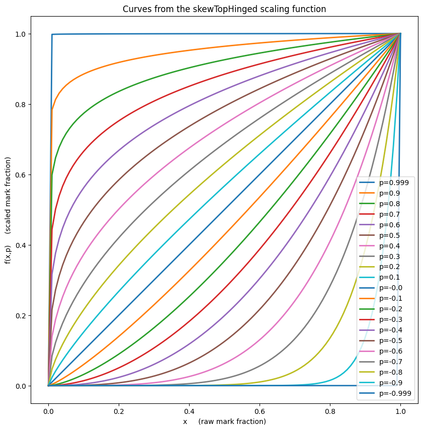
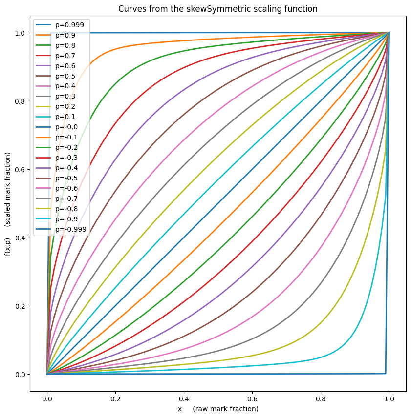

# A library of mark scaling functions which preserve endpoints.

## The following scaling functions are available:


```python
import lesterScaling
lesterScaling.scaling_functions
```


    [<function lesterScaling.hyperbolic(x, p)>,
     <function lesterScaling.skewSymmetric(x, p)>,
     <function lesterScaling.skewTopHinged(x, p)>,
     <function lesterScaling.skewBottomHinged(x, p)>]


## Example usage:


```python
import lesterScaling

raw_marks = [ 0, 10, 20, 30, 40, 50, 60, 70, 80, 90, 100 ]

max_mark = 100   # The maximum possible mark, not the largest mark obtained.

p_value = 0.05   # Parameter to choose how strong the mark scaling should be. 

# Scale the above raw marks and round to one decimal place using the "hyperbolic" scaling function:
scaled_marks_1 = [ round(lesterScaling.hyperbolic(raw_mark/max_mark, p_value)*max_mark, 1) \
                    for raw_mark in raw_marks ]

print("The hyperbolic scaling option with strength p="+str(p_value)+" scales these raw marks:\n")
print("     "+str(raw_marks))
print("")
print("to these scaled marks:\n")
print("     "+str(scaled_marks_1)+".")

# Scale the above raw marks and round to one decimal place using the "skewMean" scaling function:
scaled_marks_2 = [ round(lesterScaling.skewSymmetric(raw_mark/max_mark, p_value)*max_mark, 1) \
                    for raw_mark in raw_marks ]

print("")
print("Alternatively, for the same scaling strength the skewSymmetric scaling function would generate:\n")
print("     "+str(scaled_marks_2)+".\n")


```

    The hyperbolic scaling option with strength p=0.05 scales these raw marks:
    
         [0, 10, 20, 30, 40, 50, 60, 70, 80, 90, 100]
    
    to these scaled marks:
    
         [0.0, 11.9, 23.4, 34.4, 44.9, 55.0, 64.7, 74.0, 83.0, 91.6, 100.0].
    
    Alternatively, for the same scaling strength the skewSymmetric scaling function would generate:
    
         [0.0, 11.7, 22.6, 33.1, 43.4, 53.5, 63.3, 73.0, 82.4, 91.5, 100.0].
    


## Dependencies

lesterScaling has no dependencies if you use only the skew scaling functions.

lesterScaling depends on numpy if you use the hyperbolic scaling function.

lesterScaling depends on matplitlib if you use its built-in scaling function drawing methods.


## The available scaling functions:

### General notes applicable to all scaling functions:

Each of the LESTER SCALING FUNCTIONS provided in this library is is a function f(x,p) 
defined on x in [0,1] and p in (-1,+1) in such a way that the following properties hold:

1. f(x,p) is always in [0,1].
2. f(x,0) = x 
3. f(1,p) = 1.
4. f(0,p) = 0.
5. f(x,p) < f(y,p)  if and only if x < y  (up to float precision effects)
6. f(x,p) > f(y,p)  if and only if x > y  (up to float precision effects)
7. lim_{p->+1} f(x,p) = 1 for all x in (0,1].
8. lim_{p->-1} f(x,p) = 0 for all x in [0,1).

In other words:

* each of the LESTER SCALING FUNCTIONS is a non-linear endpoint-preserving and rank-preserving
 rescaling of x on the unit interval [0,1], 
* p=0 is is the trivial mapping x --> x,
* maximal up-weigthing is approached as p --> +1, and
* maximal dn-weigthing is approached as p --> -1.

A scaling function, f, could be used to scale individual raw marks as follows:

        scaled_mark = max_mark * f(raw_mark/max_mark, p)

where max_mark is the largest mark possible (usually 100), and "p" is a strength of the scaling.

Note that the non-linear nature of these scaling functions means that the value of 
p needed to achieve any given movement of the mean of the distrubution being scaled cannot usually be found without iteration. 
However, it is a simple matter to play a shooting-game to establish
the correct value of p to any desired mean movement as the family of functions is 
monotonic in p (and x).


## Hyperbolic scaling function:

### Pros:
* Very symmetric and easy to define conceptually.
* Conceptual definition has impartiality (not favouring/disfavouring any particular class of student) at its core.
### Cons
* Implementation must consider and work around instability at \\(p=0\\).
* Algebraic forumla looks opaque.
* No scaling function is every truly fair. Each is arbitrary it its own way.
### Formula:

These are the UNIQUELY determined family of hyperbolae (in \\( (x,f(x,p)) \\) space with the following properties:
*  each hyperbola passes through the top right and bottom left corners of the unit square with corners (0,0) amd (1,1), 
*  each hyperbola is symmetric about the diagonal running from top-left to bottom right of that unit square,
*  the location of the midpoint of each hyperbola,  \\(\text{mid}(p)\\), satisfies:
\\(                         \text{mid}(p) = (1/2 - p/2, 1/2 + p/2) \\)
           ... i.e.  the last-mentioned diagonal is traversed at uniform speed if "p" 
           is varied at constant speed, and 
* they hyperbolae are assymptotic to the boundaries of the unit square at as \\(p\\) tends to \\(\pm1\\).

The above requirements force:
\\[ f(x,p) = {b - \sqrt{b^2-ac} \over a} \\]

where

\\[ s = \text{sign} (p), \\]

\\[ a=(1-|p|)^2, \\]

\\[ b=a(1-x) + 2x + s-1, \\]
and
\\[ c=x (a(x-2) + 2s + 2). \\]

The above function is susecptible to numerical instability for \\(p\\) close to zero, so in the implementation a conditioner is applied to prevent problems.


```python
lesterScaling.plot_scaling_function_curves(functions=(lesterScaling.hyperbolic,))
```


    

    


## "Top Hinged" Skew scaling function:

### Pros:
* Simple algebraic formula.
* No numerical instability.
* Good if you want approximately a linear stretch toward centered on 100%.
### Cons
* Formula is totally arbitrary (i.e. it is not constructed with any particular ideas of fairness in mind).
* It rescales low marks very differently to high marks. It may therfore not be percieved as impartial.
* No scaling function is every truly fair. Each is arbitrary it its own way.
### Notes:
The top hinged skew scaling functioins are the bottom hinged ones rotated by 180 degrees about the centre of the unit square.

### Formula:
\\( f(x,p) = x^{\frac {1-p}{1+p}}\\)


```python
lesterScaling.plot_scaling_function_curves(functions=(lesterScaling.skewTopHinged,))
```


    

    


## "Bottom Hinged" Skew scaling function:

### Pros:
* Simple algebraic formula.
* No numerical instability.
* Good if you want approximately a linear stretch toward centered on 0%.
### Cons:
* Formula is totally arbitrary (i.e. it is not constructed with any particular ideas of fairness in mind).
* It rescales low marks very differently to high marks. It may therfore not be percieved as impartial.
* No scaling function is every truly fair. Each is arbitrary it its own way.

### Notes:
The bottom hinged skew scaling functioins are the top hinged ones rotated by 180 degrees about the centre of the unit square.
### Formula:
\\( f(x,p) = 1-(1-x)^{\frac {1+p}{1-p}}\\)


```python
lesterScaling.plot_scaling_function_curves(functions=(lesterScaling.skewBottomHinged,))
```


    

    


## "Symmetric" Skew scaling function:

### Pros:
* Simple algebraic formula.
* No numerical instability.
* Formula is marginally less arbitrary than the other scaling functions, as it at least attempts to treat people in the top x% of the mark range symmetrically to how it treats the people in the bottom x% of the mark range.
### Cons:
* Formula is still fairly arbitrary.
* No scaling function is every truly fair. Each is arbitrary it its own way.

### Notes:
The bottom hinged skew scaling functioins are the top hinged ones rotated by 180 degrees.
### Formula:
\\( f(x,p) = \frac  1 2 (t(x,p) + b(x,p)) \\)
where \\(t(x,p)\\) and \\(b(x,p)\\) are the top and bottom hinged skew scaling functions.


```python
lesterScaling.plot_scaling_function_curves(functions=(lesterScaling.skewSymmetric,))
```


    

    


```python

```
