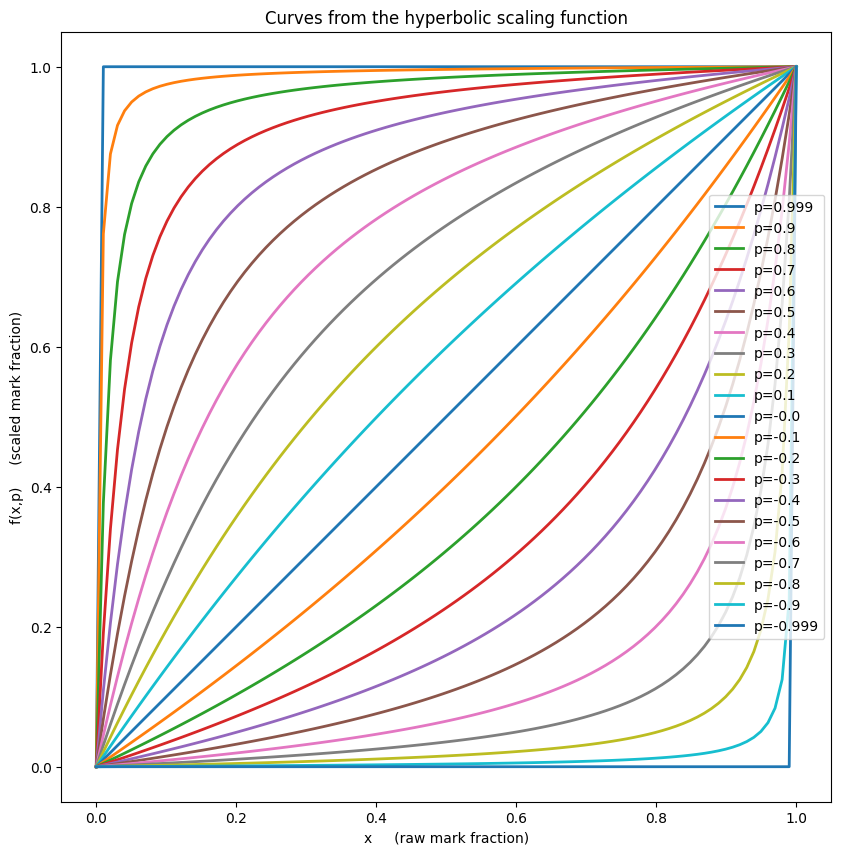
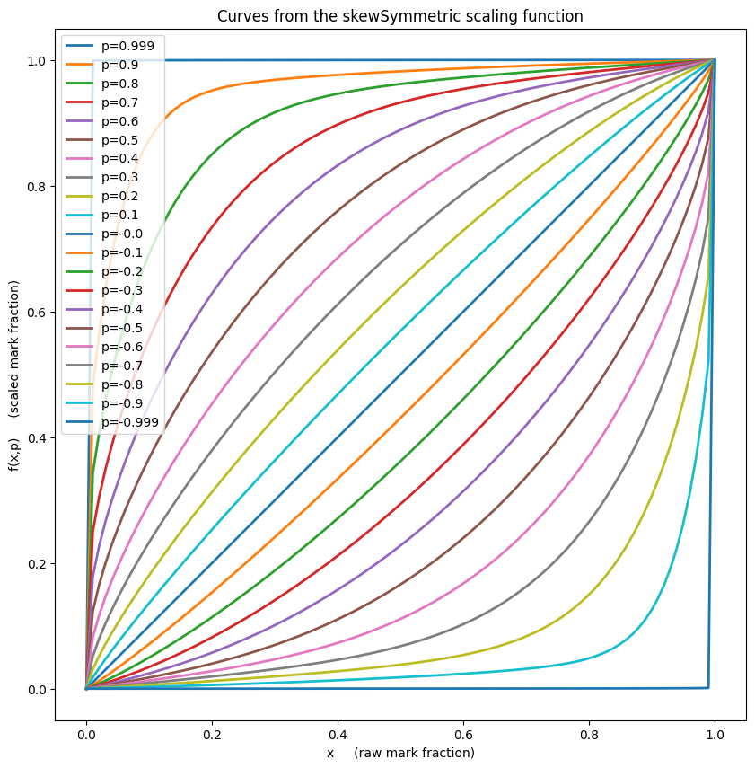
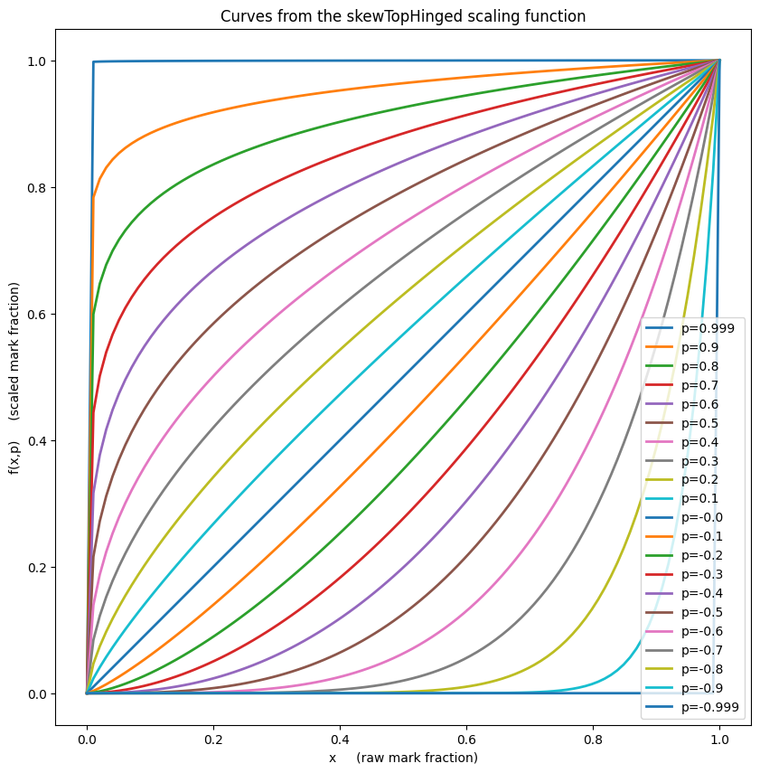

# A library of mark scaling functions which preserve endpoints.

Each of the LESTER SCALING FUNCTIONS provided in this library is is a function f(x,p) 
defined on x in [0,1] and p in (-1,+1) in such a way that the following properties hold:

1. f(x,p) is always in [0,1].
2. f(x,0) = x 
3. f(1,p) = 1.
4. f(0,p) = 0.
5. f(x,p) < f(y,p)  if and only if x < y.
6. f(x,p) = f(y,p)  if and only if x = y.
7. lim_{p->+1} f(x,p) = 1 for all x in (0,1].
8. lim_{p->-1} f(x,p) = 0 for all x in [0,1).

In other words:

* each of the LESTER SCALING FUNCTIONS is a non-linear endpoint-preserving and rank-preserving
 rescaling of x on the unit interval [0,1], 
* p=0 is is the trivial mapping x --> x,
* maximal up-weigthing is approached as p --> +1, and
* maximal dn-weigthing is approached as p --> -1.

A scaling functions, f, could be used to scale individual raw marks as follows:

        scaled_mark = max_mark * f(raw_mark/max_mark, p)

where max_mark is the largest mark possible (usually 100), and "p" is a strength of the scaling.

Note that the non-linear nature of these scaling functions means that the value of 
p needed to achieve any given movement of the mean of the distrubution being scaled cannot usually be found without iteration. 
However, it is a simple matter to play a shooting-game to establish
the correct value of p to any desired mean movement as the family of functions is 
monotonic in p (and x).


## The following scaling functions are available:


```python
import lesterScaling
lesterScaling.scaling_functions
```


    [<function lesterScaling.hyperbolic(x, p)>,
     <function lesterScaling.skewSymmetric(x, p)>,
     <function lesterScaling.skewTopHinged(x, p)>,
     <function lesterScaling.skewBottomHinged(x, p)>]


## A couple of toy usage examples:


```python
import lesterScaling

raw_marks = [ 0, 10, 20, 30, 40, 50, 60, 70, 80, 90, 100 ]

max_mark = 100   # The maximum possible mark, not the largest mark obtained.

p_value = 0.05   # Parameter to choose how strong the mark scaling shouild be. 

# Scale the above raw marks and round to one decimal place using the "hyperbolic" scaling function:
scaled_marks_1 = [ round(lesterScaling.hyperbolic(raw_mark/max_mark, p_value)*max_mark, 1) \
                    for raw_mark in raw_marks ]

print("The hyperbolic scaling option with strength p="+str(p_value)+" scales these raw marks:\n")
print("     "+str(raw_marks))
print("")
print("to these scaled marks:\n")
print("     "+str(scaled_marks_1)+".")

# Scale the above raw marks and round to one decimal place using the "skewMean" scaling function:
scaled_marks_2 = [ round(lesterScaling.skewSymmetric(raw_mark/max_mark, p_value)*max_mark, 1) \
                    for raw_mark in raw_marks ]

print("")
print("Alternatively, for the same scaling strength the skewSymmetric scaling function would generate:\n")
print("     "+str(scaled_marks_2)+".\n")


```

    The hyperbolic scaling option with strength p=0.05 scales these raw marks:
    
         [0, 10, 20, 30, 40, 50, 60, 70, 80, 90, 100]
    
    to these scaled marks:
    
         [0.0, 11.9, 23.4, 34.4, 44.9, 55.0, 64.7, 74.0, 83.0, 91.6, 100.0].
    
    Alternatively, for the same scaling strength the skewSymmetric scaling function would generate:
    
         [0.0, 11.7, 22.6, 33.1, 43.4, 53.5, 63.3, 73.0, 82.4, 91.5, 100.0].
    


# Plot the scaling functions:


```python
lesterScaling.plot_scaling_function_curves()
```


    

    


    

    


    

    


    

    

