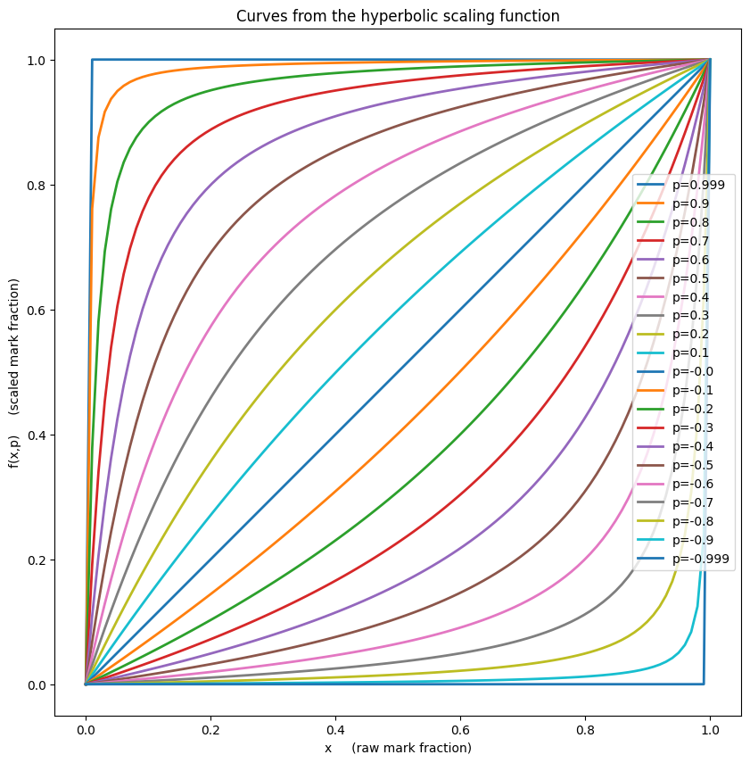
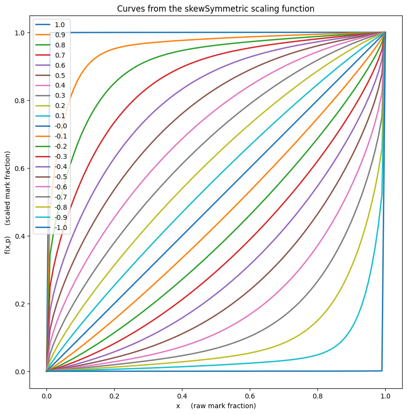
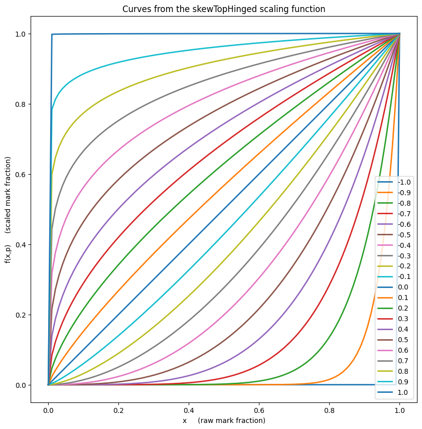
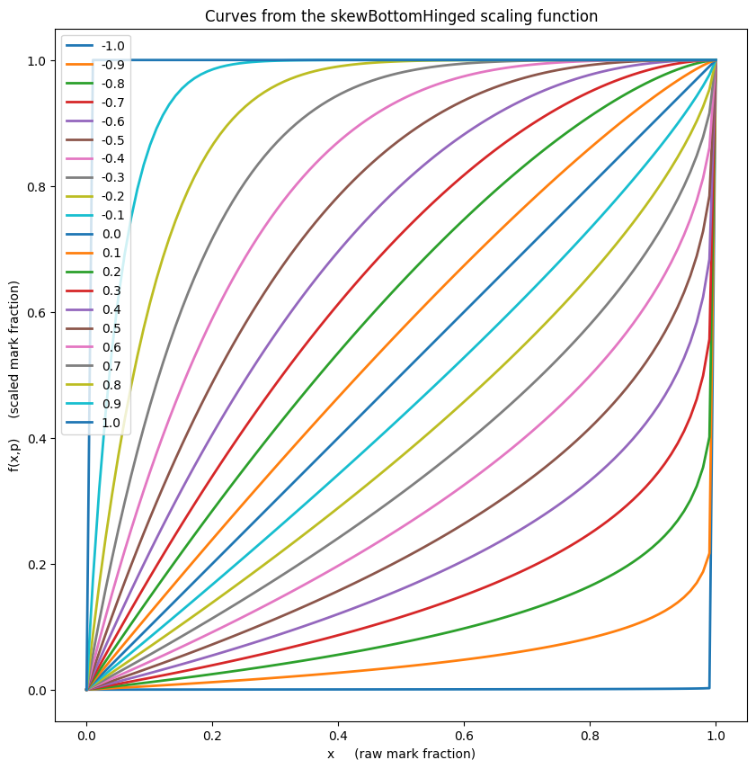

# A library of mark scaling functions which preserve endpoints.

## The following scaling functions are available:


```python
import lesterScaling
lesterScaling.scaling_functions
```


    [<function lesterScaling.hyperbolic(x, p)>,
     <function lesterScaling.skewSymmetric(x, p)>,
     <function lesterScaling.skewTopHinged(x, p)>,
     <function lesterScaling.skewBottomHinged(x, p)>]


## A couple of toy usage examples:


```python
import lesterScaling

raw_marks = [ 0, 10, 20, 30, 40, 50, 60, 70, 80, 90, 100 ]

max_mark = 100   # The maximum possible mark, not the largest mark obtained.

p_value = 0.05   # Parameter to choose how strong the mark scaling shouild be. 

# Scale the above raw marks and round to one decimal place using the "hyperbolic" scaling function:
scaled_marks_1 = [ round(lesterScaling.hyperbolic(raw_mark/max_mark, p_value)*max_mark, 1) \
                    for raw_mark in raw_marks ]

print("The hyperbolic scaling option with strength p="+str(p_value)+" scales these raw marks:\n")
print("     "+str(raw_marks))
print("")
print("to these scaled marks:\n")
print("     "+str(scaled_marks_1)+".")

# Scale the above raw marks and round to one decimal place using the "skewMean" scaling function:
scaled_marks_2 = [ round(lesterScaling.skewSymmetric(raw_mark/max_mark, p_value)*max_mark, 1) \
                    for raw_mark in raw_marks ]

print("")
print("Alternatively, for the same scaling strength the skewSymmetric scaling function would generate:\n")
print("     "+str(scaled_marks_2)+".\n")


```

    The hyperbolic scaling option with strength p=0.05 scales these raw marks:
    
         [0, 10, 20, 30, 40, 50, 60, 70, 80, 90, 100]
    
    to these scaled marks:
    
         [0.0, 11.9, 23.4, 34.4, 44.9, 55.0, 64.7, 74.0, 83.0, 91.6, 100.0].
    
    Alternatively, for the same scaling strength the skewSymmetric scaling function would generate:
    
         [0.0, 11.7, 22.6, 33.1, 43.4, 53.5, 63.3, 73.0, 82.4, 91.5, 100.0].
    


# Plot the scaling functions:


```python
lesterScaling.plot_scaling_function_curves()
```


    

    


    

    


    

    


    

    

