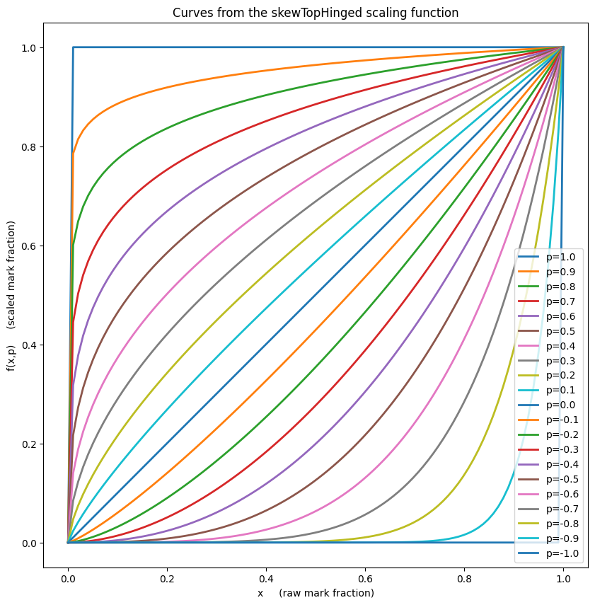
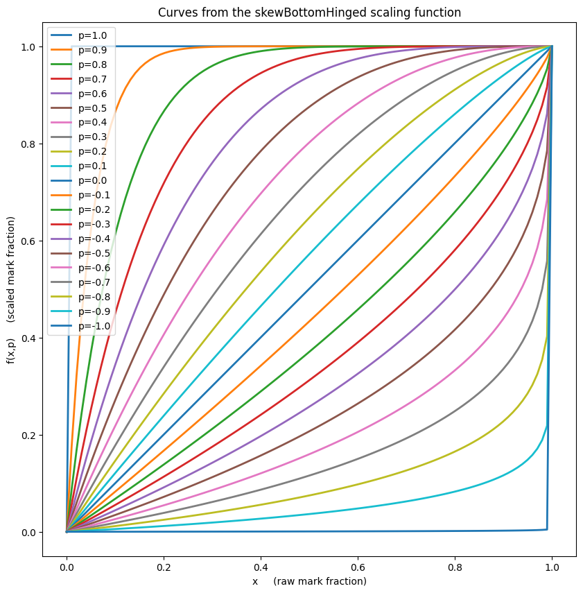
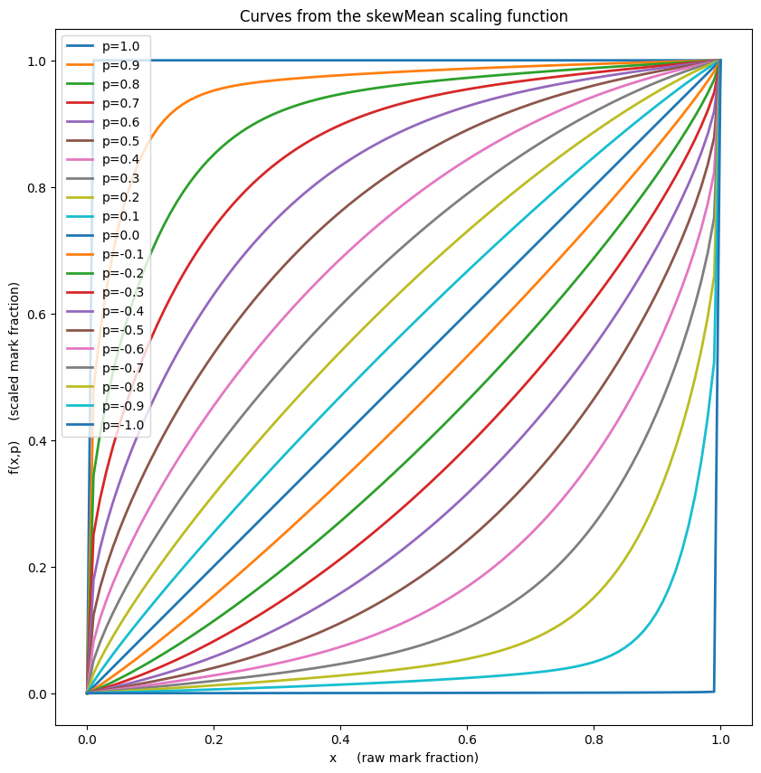

## A library of mark scaling functions which preserve endpoints.


```python
import lesterScaling
```


```python
lesterScaling.demo()
```


    

    


    

    


    

    


    

    


```python

```
